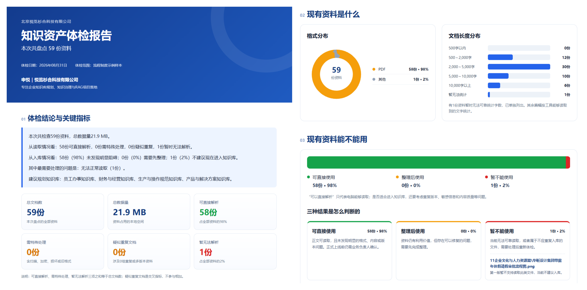
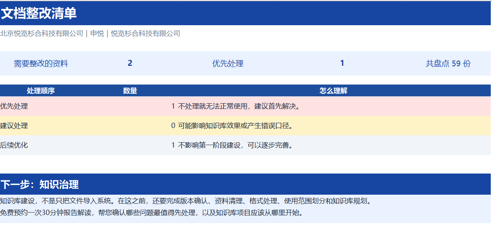
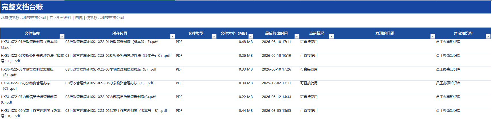
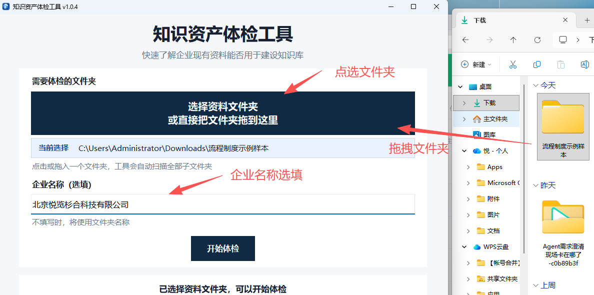
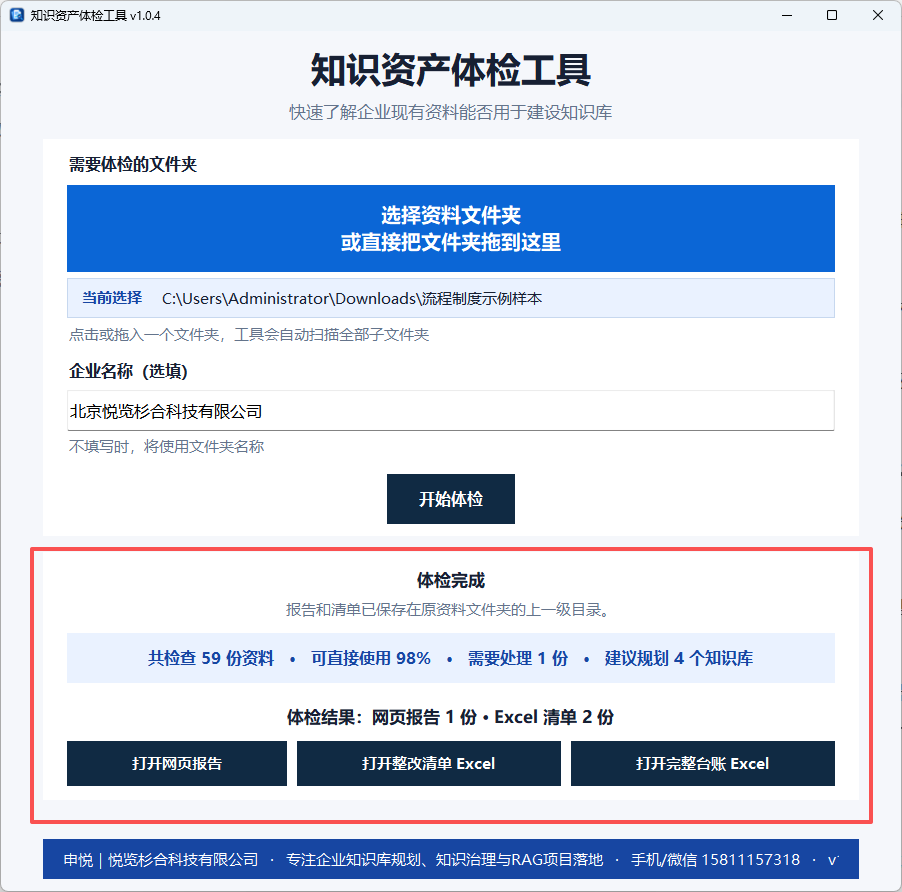

# 知识资产体检 Skill

> 诊断本地文件夹里的所有文档，一次告诉你“知识库里到底有哪些资料、哪些能直接用、先整理什么”。

一个纯本地运行的 Agent Skill。它用确定性规则盘点企业知识库资料，不让大模型阅读原文，几分钟内生成一份可离线打开的 HTML 体检报告和两份 Excel 清单。

如果你更习惯使用桌面软件，可以前往 **[知识资产体检工具官网](https://shenyueai.com/products/knowledge-health/)** 下载 Windows 或 macOS 版本，并查看完整安装说明。

[](https://github.com/s2dongman/knowledge-asset-health-check/releases/latest)
[](https://github.com/s2dongman/knowledge-asset-health-check/actions/workflows/test.yml)
[](LICENSE)

## 产品是什么

很多知识库的问题不是“没有文档”，而是资料混在一起：旧版本、重复件、空白文件、命名随意、内容过短，真正可用于搜索或 AI 问答的文档并不清楚。

本工具会回答三个问题：

1. **现在有什么**：形成完整文档台账；
2. **哪些可以入库**：给出“可直接使用、整理后使用、暂不能使用”判断；
3. **下一步先做什么**：按优先级生成可执行的整改清单。

它不会评价文档里的业务观点是否正确，也不会用大模型“猜”文档质量。

## 产品能做什么

- **隐私优先**：待体检文档不上传、不修改、不删除；
- **判断可复现**：规则引擎完成诊断，不使用大模型分析正文；
- **覆盖常见格式**：DOCX、PDF、XLSX、PPTX、TXT、Markdown；
- **自动发现问题**：无法解析、空白/过短、乱码、长期未更新、命名不规范、重复与多版本文档；
- **结果可以直接推进工作**：HTML 看全局，两份 Excel 分别用于整改和建账；
- **防止误操作**：默认不覆盖历史结果，也不允许把输出写回待体检目录内部。

## 如何安装 Skill

仓库根目录就是完整 Skill。它包含 Python 脚本，因此平台需要能够访问本机文件并执行本地命令；只有云端对话、无法访问本机目录的平台不能直接完成体检。

### 最省事：直接告诉 Agent 安装

对于能够联网、读写本机文件并执行本地命令的 Agent，可以直接把下面这段话发给它：

```text
请从 https://github.com/s2dongman/knowledge-asset-health-check 下载并安装 knowledge-asset-health-check Skill。安装到你的个人 Skill 目录，保留 scripts、references、assets 等全部文件；完成后检查 SKILL.md 能被识别，并告诉我如何调用。
```

如果 Agent 无法访问本机目录或不支持安装 Skill，请使用文末提供的 Windows 或 macOS 桌面版。

### Codex

个人安装：

```bash
git clone https://github.com/s2dongman/knowledge-asset-health-check.git \
  ~/.agents/skills/knowledge-asset-health-check
```

重新打开 Codex 后调用：

```text
使用 $knowledge-asset-health-check 体检 /path/to/documents
```

也可以在 Codex 中直接说：

```text
用 $skill-installer 从 GitHub 仓库 s2dongman/knowledge-asset-health-check 安装这个 Skill
```

Codex 当前会从 `~/.agents/skills` 读取个人 Skill，详见 [OpenAI 官方文档](https://developers.openai.com/codex/skills)。

### Claude Code

```bash
git clone https://github.com/s2dongman/knowledge-asset-health-check.git \
  ~/.claude/skills/knowledge-asset-health-check
```

重新启动 Claude Code，然后输入：

```text
/knowledge-asset-health-check 体检 /path/to/documents
```

Claude Code 的个人 Skill 目录与调用方式见 [官方文档](https://code.claude.com/docs/en/skills)。

### OpenClaw

安装为全局 Skill：

```bash
openclaw skills install git:s2dongman/knowledge-asset-health-check --global
```

然后新建一次会话，直接提出体检需求。也可以用下面的命令确认安装状态：

```bash
openclaw skills info knowledge-asset-health-check
```

OpenClaw 支持直接安装根目录含 `SKILL.md` 的 Git 仓库，详见 [官方文档](https://docs.openclaw.ai/cli/skills)。

### TRAE Work

下载 [TRAE Work 专用安装包](https://github.com/s2dongman/knowledge-asset-health-check/releases/download/v1.0.1/knowledge-asset-health-check-root-v1.0.1.zip)，然后：

1. 打开左侧 **插件市场**；
2. 进入 **技能** 页签，点击右上角 **上传技能**；
3. 选择刚下载的 ZIP，确认安装并保持启用。

该安装包已按 TRAE Work 的要求把 `SKILL.md` 放在 ZIP 根目录。操作入口与格式要求见 [TRAE 官方文档](https://docs.trae.cn/work_skills)。

### WorkBuddy

本地版可直接安装到个人 Skill 目录：

```bash
git clone https://github.com/s2dongman/knowledge-asset-health-check.git \
  ~/.workbuddy/skills/knowledge-asset-health-check
```

如果当前版本通过界面管理 Skill，则下载 [WorkBuddy 专用安装包](https://github.com/s2dongman/knowledge-asset-health-check/releases/download/v1.0.1/knowledge-asset-health-check-workbuddy-v1.0.1.zip)，进入 **专家·技能·连接器 → 技能 → 添加技能/创建技能** 后导入。安装后重新开始一次对话，再提出体检需求。

WorkBuddy 的开放平台采用 `skills/<skill-name>/SKILL.md` 结构，详见 [官方技能规范](https://open.workbuddy.cn/docs/skill)。

### 豆包工作

豆包工作的不同发布版本中，个人 Skill 入口可能不同：

1. 打开 **技能** 页面，查找 **创建技能 / 上传技能 / 导入技能**；
2. 如果界面支持 ZIP 导入，上传 [通用根目录安装包](https://github.com/s2dongman/knowledge-asset-health-check/releases/download/v1.0.1/knowledge-asset-health-check-root-v1.0.1.zip)；
3. 安装后新建会话，并明确要求使用“知识资产体检”技能检查本地文件夹。

目前没有找到豆包工作公开且稳定的第三方 Skill 导入文档。如果你的版本没有上述入口，请使用下方“直接运行”，不要把待体检文档上传到对话中。

### Hermes Agent（爱马仕）

```bash
git clone https://github.com/s2dongman/knowledge-asset-health-check.git \
  ~/.hermes/skills/knowledge-asset-health-check
```

新建会话后调用：

```text
/knowledge-asset-health-check 体检 /path/to/documents
```

Hermes 会从 `~/.hermes/skills/` 发现多文件 Skill，详见 [官方文档](https://github.com/NousResearch/hermes-agent/blob/main/website/docs/guides/work-with-skills.md)。

### 其他本地 Agent

只要能够调用本机 Python，就可以克隆仓库后直接运行：

```bash
git clone https://github.com/s2dongman/knowledge-asset-health-check.git
cd knowledge-asset-health-check
python3 scripts/run_health_check.py "/path/to/documents" --company "示例公司"
```

Windows 可把 `python3` 换成 `py -3.12` 或 `python`。

## 如何使用

安装 Skill 后，对 Agent 说：

```text
使用 knowledge-asset-health-check 体检 /path/to/documents
```

企业名称和输出目录都是选填项。默认会在待体检目录旁边新建带时间戳的结果目录。

## 使用后能看到什么结果

每次体检生成三个文件：

1. `知识资产体检报告.html`：整体健康度、问题分布、优先建议；
2. `文档整改清单.xlsx`：逐项列出问题、优先级和建议动作；
3. `完整文档台账.xlsx`：保留完整文档清册和分类判断。

### 1. 离线 HTML 体检报告



### 2. 文档整改清单



### 3. 完整文档台账



## Skill 不能用？改用桌面版

如果当前 Agent 不支持安装 Skill、不能访问本机文件，或者你不想配置 Python，可以直接安装桌面版。Windows 和 macOS 版本均可从 **[知识资产体检工具官网](https://shenyueai.com/products/knowledge-health/)** 获取。

### Windows 桌面版

选择或拖入待体检文件夹后点击开始，工具会在原目录旁生成完整结果，不上传、不修改、不删除原文档。

- 支持 Windows 10 1809 及以上、Windows 11（x64）；
- 安装后从桌面或开始菜单启动，无需另装 Python；
- 企业名称可选填，输出位置可自定义；
- 一次生成离线 HTML 体检报告、文档整改清单和完整文档台账；
- 完成后可在界面中直接打开报告或结果文件夹。

<p align="center">
  
  
</p>

> v1.0.5 延续上图所示操作界面；截图标题栏中的 v1.0.4 是上一版界面标识。

**[下载 Windows 桌面版 v1.0.5（EXE，约 22.13 MB）](https://github.com/s2dongman/knowledge-asset-health-check/releases/download/windows-v1.0.5/KnowledgeAssetHealth_Setup_v1.0.5.exe)**

SHA-256：`c5773cdbf09228bdb657a2a69d174960f8aedcd8f14974ca032da41ad2688808`

[查看发布说明](https://github.com/s2dongman/knowledge-asset-health-check/releases/tag/windows-v1.0.5)

### macOS 桌面版

当前 macOS 测试版适用于 Apple Silicon Mac（M1、M2、M3、M4、M5 及后续芯片），需要 macOS 11 Big Sur 或更高版本。

安装方法：

1. 下载并双击打开 DMG 文件；
2. 将“知识资产体检工具”拖到右侧的“Applications（应用程序）”文件夹；
3. 从“应用程序”文件夹启动工具，不要长期在 DMG 窗口中运行。

当前测试版没有购买 Apple Developer 证书，因此第一次启动时可能出现“无法验证开发者”的提示。请先关闭提示，然后打开 **系统设置 → 隐私与安全性**，找到关于“知识资产体检工具”的提示，点击 **仍要打开**，再按系统要求使用登录密码或 Touch ID 确认。完成一次放行后，后续可以像普通应用一样直接打开。

使用方法：

1. 点击“选择资料文件夹”，或者把整个文件夹拖到选择区域；
2. 企业名称可以不填，不填写时默认使用文件夹名称；
3. 点击“开始体检”；
4. 完成后直接打开网页报告、文档整改清单或完整文档台账。

文档只在本机读取和分析，不上传到网络，也不会修改或删除原文档。结果默认保存在待体检文件夹的上一级目录。

**[下载 macOS 桌面版 v1.0.5（DMG，Apple Silicon）](https://shenyueai.com/downloads/KnowledgeAssetHealth_macOS_AppleSilicon_v1.0.5.dmg)**

SHA-256：`fcff51c20aca2b728796d891f8caebf38f50a0f69604081d50b8eae5c6f5ad80`

[前往官网查看完整下载与安装说明](https://shenyueai.com/#download)

## 隐私与运行边界

- 体检过程只读取你指定的本地目录；
- 文档正文不会被发送给 Agent 或任何远程服务；
- 第一次运行如果本机缺少解析组件，执行器会在用户缓存目录创建隔离的 Python 环境并安装固定版本依赖，这一步需要联网；
- 依赖安装完成后，实际文档扫描与报告生成不发起网络请求；
- 建议先用一份非敏感样例目录试跑，再用于企业资料。

## 反馈、报 Bug 与交流

如果报告里出现误判、漏判，或者你遇到这里没有覆盖的常见文档问题，欢迎添加作者微信 **s2dongman**，备注 **“体检”**。也可以把脱敏后的报告发来，我会尽量给出下一步整理建议。

桌面版下载、安装说明和产品更新请访问 **[知识资产体检工具官网](https://shenyueai.com/products/knowledge-health/)** 

<p align="center">
  
  <br>
  <strong>微信：s2dongman｜备注：体检</strong>
</p>

## 环境要求与技术说明

- Python 3.9+
- Windows、macOS 或 Linux
- 命令行参数、JSON 输出与退出码见 [references/output-contract.md](references/output-contract.md)

开发验证：

```bash
python3 -m venv .venv
.venv/bin/python -m pip install -r scripts/requirements.txt
.venv/bin/python -m unittest discover -s tests -v
```

## 许可证

[MIT License](LICENSE)
